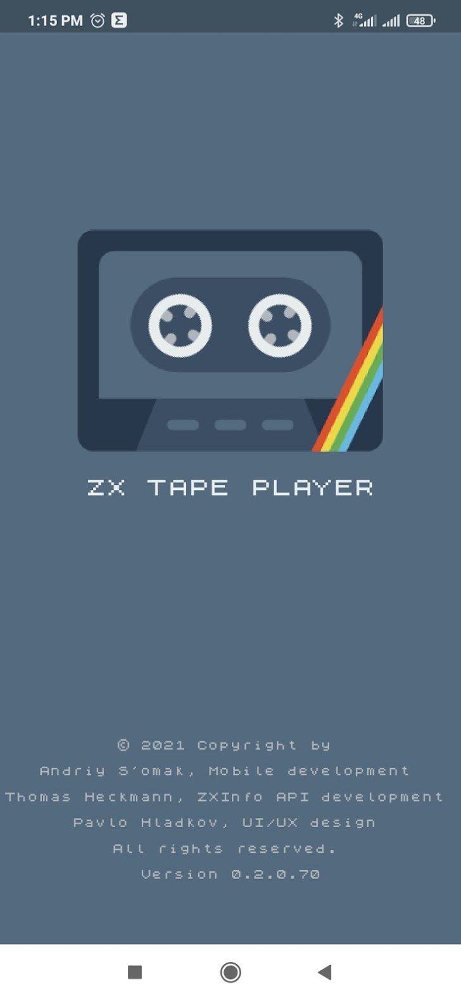

# ZX Tape Player 

Another tape player has written in Flutter for iOS and Android. The application is able to find tape images from the internet and upload them to ZX-Spectrum compatible computers by the audio output of the smartphone.

## Screenshots

## LICENSE
Please see [LICENSE.md](https://github.com/semack/zx_tape_player/blob/master/LICENSE.md) for details.

## Contribute
Contributions are welcome. Just open an Issue or submit a PR. 

## Contact
You can reach me via my [email](mailto://semack@gmail.com).

